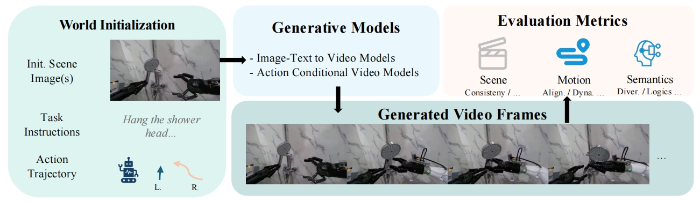
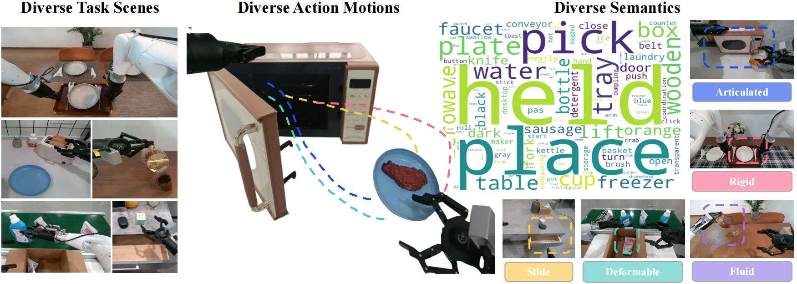

# EWMBench: Evaluating Scene, Motion, and Semantic Quality in Embodied World Models

<div id="top" align="center">




 <a href='https://arxiv.org/abs/2505.09694'></a> &nbsp; <a href='https://huggingface.co/agibot-world/EWMBench-model'></a> &nbsp; <a href=' https://huggingface.co/datasets/agibot-world/EWMBench
'></a> &nbsp;


</div>

**Embodied World Model Benchmark (EWMBM)** is a benchmark framework specifically designed to evaluate **Embodied World Models (EWMs)**, aiming to assess the performance of text-driven video generation models in embodied tasks. EWMBM systematically evaluates the **physical plausibility** and **task coherence** of generated content across three key dimensions: **visual scene consistency**, **motion correctness**, and **semantic alignment**. Compared to traditional perceptual metrics, EWMBM focuses more on the **practical usability** and **rationality** of generation results within embodied contexts. It is accompanied by a **multi-dimensional evaluation toolkit** and a **high-quality, diverse dataset**, providing insights into the limitations of current methods and driving progress toward the next generation of embodied intelligence models.


## Getting started


### Setup

* CUDA Version: 11.8
* Python 3.10+ recommended
* Use `conda` or `virtualenv` for environment isolation

```
conda create -n EWMBench python=3.10.16
conda activate EWMBench
git clone --recursive https://github.com/AgibotTech/EWMBench
cd EWMBench
pip install -r requirements.txt
pip install git+https://github.com/openai/CLIP.git

```

---

### Pre_trained Weights

1. Download the official Qwen2.5 checkpoint from [Qwen2.5](https://huggingface.co/Qwen/Qwen2.5-VL-7B-Instruct) , and the tool of Qwen2.5 come from [Qwen2.5-tool](https://github.com/QwenLM/Qwen2.5-VL/tree/main/qwen-vl-utils) and modify to adapt our algorithm.

2. Download the [clip-vit-base-patch16](https://huggingface.co/openai/clip-vit-base-patch16) weight and [CLIP-vit-b-32](https://openaipublic.azureedge.net/clip/models/40d365715913c9da98579312b702a82c18be219cc2a73407c4526f58eba950af/ViT-B-32.pt) weight.

3. Download [the our finetuned DINOv2 and YOLO-World](https://huggingface.co/agibot-world/EWMBench-model) weights.


**We need to add the path of each weight to config.yaml.**


---


### Data Preparation
1. Download the dataset from [hugging face](https://huggingface.co/datasets/agibot-world/EWMBench)
2. Move the download dataset to ./data

Our ground truth data is stored in the `gt_dataset` folder. This folder contains the standard datasets used to verify model accuracy.

For your reference, we also provide a sample set of the generated results .

It is important to follow the required directory structure outlined below to ensure compatibility.

- **Ground Truth Data** 

```
gt_dataset/
├── task_1/
│   ├── episode_1/
│   │   ├── prompt/
│   │   │   ├── init_frame.png
│   │   │   └── introduction.txt
│   │   └── video/
│   │       ├── frame_00000.jpg
│   │       ├── ...
│   │       └── frame_0000n.jpg
│   ├── episode_2/
│   └── ...
├── task_2/
└── ...
```

- **Generated Samples**

```
generated_samples/
├── task_1/
│   ├── episode_1/
│   │   ├── 1/
│   │   │   └── video/
│   │   │       ├── frame_00000.jpg
│   │   │       ├── ...
│   │   │       └── frame_0000n.jpg
│   │   ├── 2/
│   │   └── 3/
│   ├── episode_2/
│   └── ...
├── task_2/
└── ...
```

### Data Preprocessing 

To preprocess the inference data, use the following command:

```
cd /path/to/ewmbm
bash ./EWMBench/processing.sh ./config.yaml
```

Note: Ground truth detection must be performed on first run.

**After processing, please check the data directory structure**

> ⚠️ If your data structure does not match the following format, it does not meet the benchmark requirements.

- **Ground Truth Data** 

```
gt_dataset/
├── task_1/
│   ├── episode_1/
│   │   ├── gripper_detection/
│   │   │   └── video.mp4
│   │   ├── prompt/
│   │   │   ├── init_frame.png
│   │   │   └── introduction.txt
│   │   ├── traj/
│   │   │   └── traj.npy
│   │   └── video/
│   │       ├── frame_00000.jpg
│   │       ├── ...
│   │       └── frame_0000n.jpg
│   ├── episode_2/
│   └── ...
├── task_2/
└── ...
```

- **Generated Samples**

```
generated_samples/
├── task_1/
│   ├── episode_1/
│   │   ├── 1/
│   │   │   ├── gripper_detection/
│   │   │   │   └── video.mp4
│   │   │   ├── traj/
│   │   │   │   └── traj.npy
│   │   │   └── video/
│   │   │       ├── frame_00000.jpg
│   │   │       ├── ...
│   │   │       └── frame_0000n.jpg
│   │   ├── 2/
│   │   └── 3/
│   ├── episode_2/
│   └── ...
├── task_2/
└── ...
```

---


## Running Evaluation

1. Modify the configuration file:

```
# modify config.yaml
```


2. To run evaluation tasks:

```
cd /path/to/ewmbm
python /path/to/ewmbm/evaluate.py --dimension 'semantics' 'trajectory_consistency' --config ./config.yaml
```

Available dimensions include:

* `diversity`
* `scene_consistency`
* `trajectory_consistency`
* `semantics`

---

Your results save as .csv file.


## Citation

Please consider citing our paper if our codes are useful:
```bib
@article{hu2025ewmbench,
  title={EWMBench: Evaluating Scene, Motion, and Semantic Quality in Embodied World Models},
  author={Hu, Yue and Huang, Siyuan and Liao, Yue and Chen, Shengcong and Zhou, Pengfei and Chen, Liliang and Yao, Maoqing and Ren, Guanghui},
  journal={arXiv preprint arXiv:2505.09694},
  year={2025}
}
```


## License

All the data and code within this repo are under [CC BY-NC-SA 4.0](https://creativecommons.org/licenses/by-nc-sa/4.0/).
